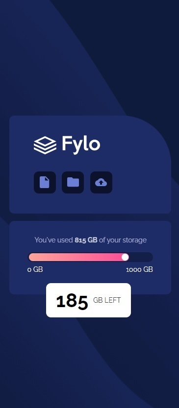

- Overview:
  - [Fylo Data Storage Component]
  - [https://wella4life.github.io/Challenge_2_Medium/]
  - 
  - 

 - Users should be able to:
   - View the optimal layout for the site depending on their device's screen size

 - What I Learned:
   - First time using background-image - linear-gradient and used it correctly
   - First time using linear-gradient as a background color
   - First time using clip - rect() to take a rectangle from a shape
   - First time using clip-path to make anyshape "triangle in this case"
   - Applying Grid and Flexbox right makes the swap to Mobile or Desktop very very easy
 
 - What I Couldn't Do:
   - Nothing
